# Formula 1 – ER Diagram (Chen Notation, Mermaid)

Hocanın slaytındaki **COMPANY** örneği gibi Chen notasyonu:
- Dikdörtgen = entity
- Çift çerçeveli dikdörtgen = **weak entity** (`RACE`)
- Eşkenar dörtgen = relationship
- Elips = attribute
- **Kalın + altı çizili** = primary key / partial key
- Kenar etiketleri = cardinality (1, N, M, P …)

```mermaid
flowchart TB
  classDef entity fill:#eaf0ff,stroke:#333,stroke-width:1.5px,color:#111
  classDef weak   fill:#eaf0ff,stroke:#333,stroke-width:3px,color:#111
  classDef rel    fill:#fff6cc,stroke:#333,color:#111
  classDef attr   fill:#ffffff,stroke:#333,color:#111
  classDef pk     fill:#ffffff,stroke:#333,color:#111,font-weight:bold,text-decoration:underline

  %% ===== ENTITIES =====
  SEASON[SEASON]:::entity
  TEAM[TEAM]:::entity
  DRIVER[DRIVER]:::entity
  CIRCUIT[CIRCUIT]:::entity
  RACE[[RACE]]:::weak

  %% ===== RELATIONSHIPS (diamonds) =====
  HAS_RACE{HAS_RACE}:::rel
  HOSTS{HOSTS}:::rel
  CONTRACTS{CONTRACTS}:::rel
  STANDINGS{STANDINGS}:::rel
  RESULTS{RESULTS}:::rel

  %% ===== SEASON attributes =====
  SY([season_year]):::pk --- SEASON

  %% ===== TEAM attributes =====
  TID([team_id]):::pk --- TEAM
  TNM([team_name]):::attr --- TEAM
  TFN([full_name]):::attr --- TEAM
  TFY([founding_year]):::attr --- TEAM
  TBC([base_country]):::attr --- TEAM
  TBCI([base_city]):::attr --- TEAM
  TCH([team_chief]):::attr --- TEAM
  TES([engine_supplier]):::attr --- TEAM

  %% ===== DRIVER attributes =====
  DID([driver_id]):::pk --- DRIVER
  DCN([car_no]):::attr --- DRIVER
  DCD([driver_code]):::attr --- DRIVER
  DFN([first_name]):::attr --- DRIVER
  DLN([last_name]):::attr --- DRIVER
  DNA([nation]):::attr --- DRIVER
  DBD([birth_date]):::attr --- DRIVER
  DPO([num_poles]):::attr --- DRIVER
  DPD([num_podiums]):::attr --- DRIVER
  DCH([num_championships]):::attr --- DRIVER

  %% ===== CIRCUIT attributes =====
  CID([circuit_id]):::pk --- CIRCUIT
  CNM([circuit_name]):::attr --- CIRCUIT
  CCO([country]):::attr --- CIRCUIT
  CCI([city]):::attr --- CIRCUIT
  CLP([laps]):::attr --- CIRCUIT
  CLE([length_m]):::attr --- CIRCUIT
  CFG([first_gp_year]):::attr --- CIRCUIT
  CFL([fastest_lap_time]):::attr --- CIRCUIT

  %% ===== RACE (weak) attributes – partial key: round_number =====
  RRN([round_number]):::pk --- RACE
  RGP([grand_prix_name]):::attr --- RACE
  RSD([race_start_date]):::attr --- RACE
  RED([race_end_date]):::attr --- RACE

  %% ===== Relationship attributes =====
  CTR1([role]):::attr --- CONTRACTS
  CTR2([seat_no]):::attr --- CONTRACTS

  STP1([season_position]):::attr --- STANDINGS
  STP2([season_points]):::attr --- STANDINGS

  RSP1([grid_position]):::attr --- RESULTS
  RSP2([finish_position]):::attr --- RESULTS
  RSP3([points]):::attr --- RESULTS

  %% ===== RELATIONSHIP EDGES (with cardinalities) =====
  %% SEASON (1) - HAS_RACE - (N) RACE  [identifying relationship for weak entity]
  SEASON ---|1| HAS_RACE
  HAS_RACE ===|N| RACE

  %% CIRCUIT (1) - HOSTS - (N) RACE
  CIRCUIT ---|1| HOSTS
  HOSTS ---|N| RACE

  %% Ternary: SEASON (M), TEAM (N), DRIVER (P) through CONTRACTS
  SEASON ---|M| CONTRACTS
  TEAM ---|N| CONTRACTS
  DRIVER ---|P| CONTRACTS

  %% SEASON (M) - STANDINGS - (N) TEAM  [M:N with attributes]
  SEASON ---|M| STANDINGS
  STANDINGS ---|N| TEAM

  %% RACE (M) - RESULTS - (N) DRIVER  [M:N with attributes]
  RACE ---|M| RESULTS
  RESULTS ---|N| DRIVER
```

## Notlar
- `RACE` zayıf varlıktır; PK’si `(season_year, round_number)` olup `season_year` `SEASON` üzerinden `HAS_RACE` ile gelir (çift çerçeveli gösterim). `round_number` partial key’dir.
- `CONTRACTS` (SQL’deki `team_drivers`) üçlü bir ilişkidir; `role`, `seat_no` ilişkinin attribute’larıdır.
- `STANDINGS` (SQL’deki `team_standings`), `RESULTS` (SQL’deki `race_results`) attribute taşıyan ikili ilişkilerdir.
- Mermaid `flowchart` kullandığımız için Chen sembollerini en yakın eşdeğerlerle (dikdörtgen / eşkenar dörtgen / stadyum ≈ elips / çift-border dikdörtgen) çizdik.
